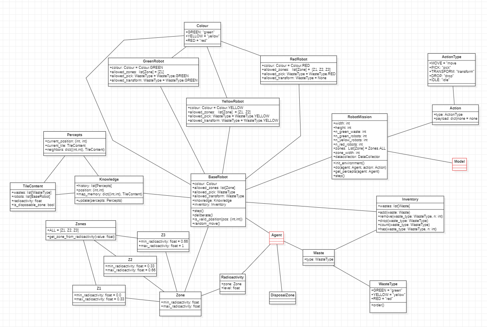
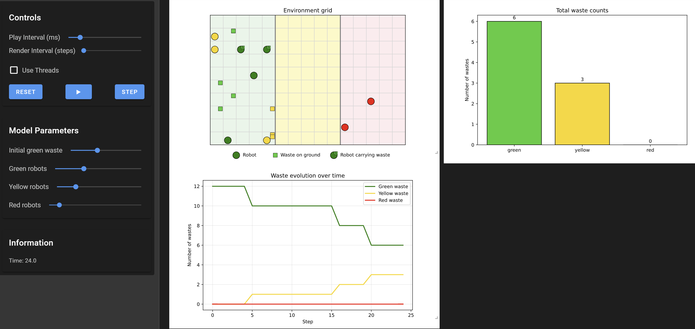

# MAS project


## Table of Contents
1. [Overview](#overview)
2. [Development](#development)
3. [Project Structure](#project-structure)
4. [Simulation Preview](#simulation-preview)
5. [Contributors](#contributors)

## Overview


## Development
This project follows the best practices we currently rely on for building maintainable Python projects. We use:

- **`uv`** for dependency management  
- **`pre-commit`** for automated code quality checks  
- **`Ruff`** for linting and formatting (a VS Code configuration is included)  
- **`Makefile`** to run common commands consistently

### Requirements
- **Python 3.12**
- **`uv`** (recommended) for dependency management and to automatically create the package link for a smoother development workflow
- **`make`** (recommended) to use the provided Makefile commands

### Environment setup
Install dependencies and set up `pre-commit` hooks:
```bash
make install
```

### Code quality
Run linting/formatting checks via `pre-commit`:
```bash
make pre-commit
```


## Project Structure
You'll find all the utility functions and classes (Python `.py` files) you'll need for our experiments and tests in the [`src`](./src/) folder. 

## Project Scope
The project implements a multi-agent simulation of robots operating in a hostile environment structured into three radioactivity zones. The environment is initialized on a grid, the three robot types are instantiated with their movement constraints, the waste transformation chain from green to yellow then from yellow to red is operational, and the disposal area is handled at the right edge of the grid. No optimization strategy has been implemented at this point. The current behaviors therefore correspond to a baseline configuration in which movements are mainly random, with local rule priorities for picking up, transforming, transporting, and dropping waste.

## Object-Oriented Architecture
The code is organized around a clear separation between the model, the agents, the objects placed in the environment, and the support classes used for decision making. The `RobotMission` class in `model.py` is the central controller of the simulation. It creates the grid, assigns the radioactivity zones, places wastes and robots, executes actions, generates percepts, and collects the data used for visualization. The robot classes are defined in `agents.py`. `BaseRobot` provides the common structure shared by all robots, including an inventory, a local knowledge base, the generic simulation step, position validation, and random movement. `GreenRobot`, `YellowRobot`, and `RedRobot` then specialize this base class by fixing the accessible zones, the handled waste type, and the decision rules associated with their role in the processing chain.

Several object-oriented support classes were added to make the implementation more modular than a minimal reading of the subject would require. The `Waste`, `Radioactivity`, and `DisposalZone` classes in `objects.py` explicitly model the entities present on the grid. The `Action` class in `core/actions.py` formalizes what a robot asks the environment to do. The `Inventory` class in `core/inventory.py` isolates waste storage and manipulation inside each robot. The `Knowledge` class in `core/knowledge.py` stores the robot's current position, its percept history, and its local map memory. The `Percepts` and `TileContent` data structures in `core/percepts.py` standardize what a robot can observe at each step. The zone system is also encapsulated in dedicated classes in `core/zones.py`, with `Z1`, `Z2`, and `Z3` representing the three radioactivity intervals and `Zones` grouping the global configuration. Finally, `core/enums.py` centralizes the enumerations for colors, action types, and waste types, which keeps the rest of the code simpler and more consistent.

Here is a quick class diagram to illustrate our architecture (each link mean "has an instance of" or "uses an instance of"):




## Visualization and Execution
The visualization layer is separated from the simulation logic. The `server.py` file defines the Solara interface, the graphical rendering of the grid, and the plots that track the number of green, yellow, and red wastes over time. The `run.py` file only exposes this page as the application entry point. This organization keeps the interface code distinct from the environment rules and the decision logic.

Here is a quick overview of simulation displays:




## Results and Current Choices
The current results validate the core mechanics of the simulation. The execution shows that green waste can be collected in zone 1, transformed into yellow waste, carried into zone 2, transformed again into red waste, then transported to the disposal zone by red robots. The plots serve to verify the proper evolution of the different waste categories during execution. Since no optimization strategy has been introduced yet, there is no comparison between behavioral strategies or tested configurations at this stage. The conceptual choice retained here is therefore a simple and readable baseline, designed to validate the environment, the interactions, and the complete treatment chain.


## Simulation Preview
launch the simulation with:
```bash
make solara-server
```


## Contributors

|            Name            |                Email                  |
| :------------------------: | :-----------------------------------: |
|    MOLLY-MITTON Clément    |    clement.mollymitton@gmail.com      |
|       VERBECQ DIANE        |        diane.verbecq@gmail.com        |
