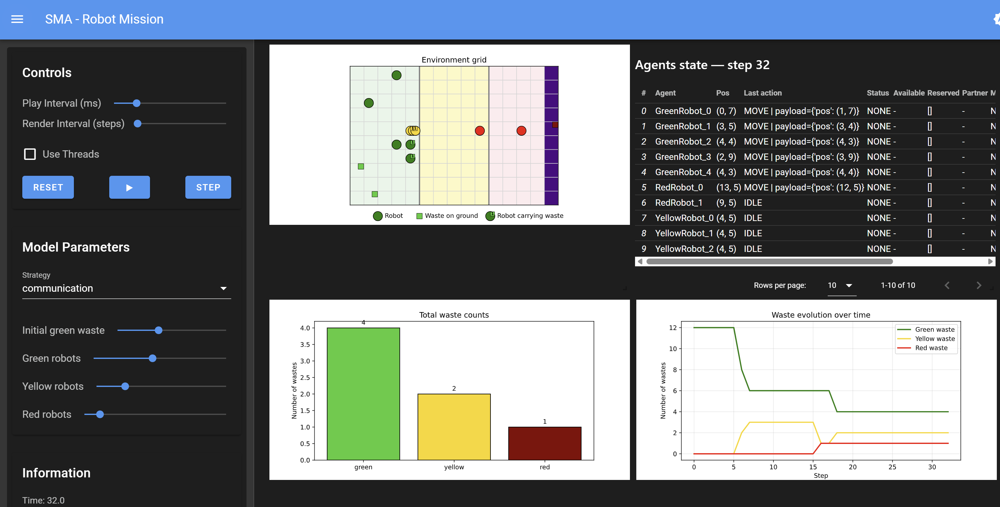
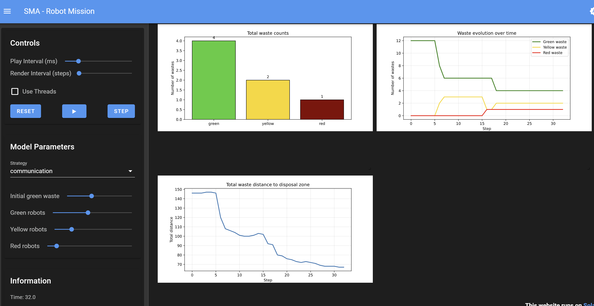
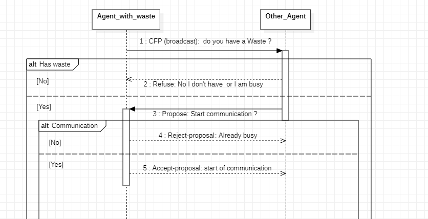
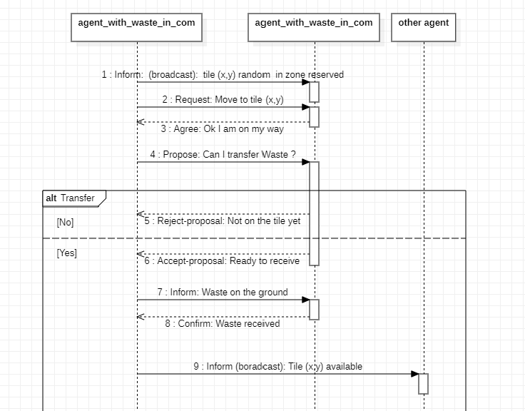
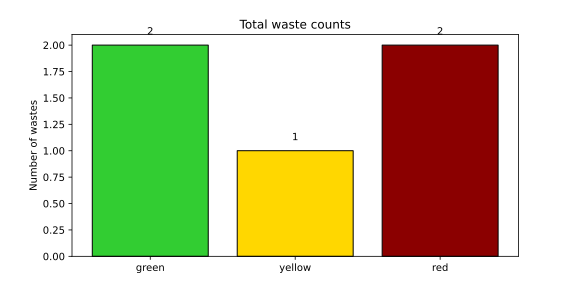
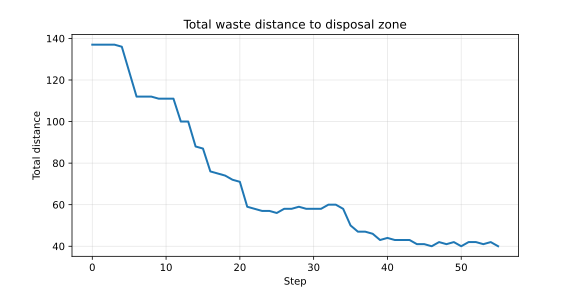
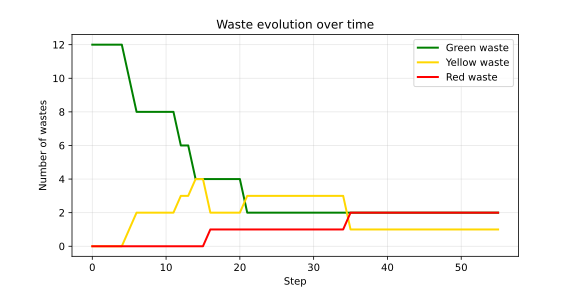
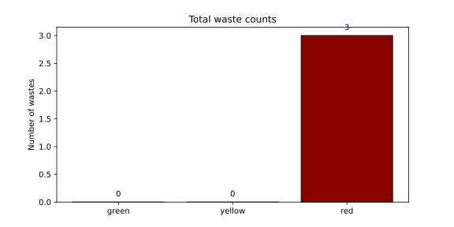
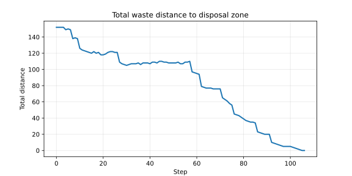
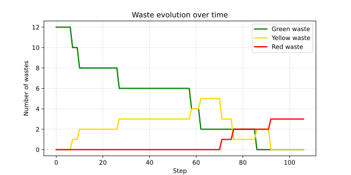

# MAS project


## Table of Contents
1. [Overview](#overview)
2. [Development](#development)
3. [Project Scope](#project-scope)
4. [Architecture](#architecture)
5. [Protocols](#protocols)
6. [Strategies](#strategies)
7. [Simulation Preview](#simulation-preview)
8. [Contributors](#contributors)

## Overview


## Development
This project follows the best practices we currently rely on for building maintainable Python projects. We use:

- **`uv`** for dependency management  
- **`pre-commit`** for automated code quality checks  
- **`Ruff`** for linting and formatting (a VS Code configuration is included)  
- **`Makefile`** to run common commands consistently

### Requirements
- **Python 3.12**
- [**`uv`**](https://docs.astral.sh/uv/) (recommended) for dependency management and editable installs (alternatively, you can manage dependencies via the `requirements.txt` generated with `uv`).
- **`make`** (recommended) to use the provided Makefile commands (alternatively, you can execute the underlying commands manually).

### Environment setup
Install dependencies and set up `pre-commit` hooks:
```bash
make install
```

### Code quality
Run linting/formatting checks via `pre-commit`:
```bash
make pre-commit
```

## Project Scope
This project focuses on a multi-agent simulation in which robots operate within a hostile environment divided into three distinct radioactivity zones. The environment is modeled as a grid where three different types of robots are deployed, each following its own movement constraints.

Within this setting, a waste transformation process takes place. As the simulation progresses, waste is gradually transformed from green to yellow, and then from yellow to red. At the same time, a dedicated disposal area is positioned on the right edge of the grid, serving as the final destination for all processed waste.

Given this setup, the main objective of the simulation is to maximize waste compaction while ensuring that all waste is efficiently transported to the disposal area.

However, the robots do not operate with complete information. Each robot only has partial knowledge of the system, it is aware of the names of other robots of the same type, and its perception of the environment is limited to the four adjacent tiles (excluding diagonals) and what he has seen.

To tackle these constraints, two different strategies are explored. On the one hand, a basic approach without communication is implemented, where robots act independently using simple behaviors. On the other hand, a more advanced strategy introduces a communication protocol, enabling robots to coordinate their actions and achieve more efficient and optimized waste compaction and transportation.

The objective of the system is not only to eventually dispose of waste, but to do so as efficiently as possible. In our implementation, we evaluate efficiency mainly through the number of simulation steps required to eliminate all waste from the environment. We also monitor intermediate indicators such as the evolution of the number of green, yellow and red wastes over time, and the progression of waste toward the disposal zone. This allows us to compare a baseline random strategy with a communication-based strategy under the same environment conditions.


## Architecture
### Logic
The code is organized around a clear separation between the model, the agents, the objects placed in the environment, and the support classes used for decision making. The `RobotMission` class in [`model.py`](./src/model.py) is the central controller of the simulation. It creates the grid, assigns the radioactivity zones, places wastes and robots, executes actions, generates percepts, and collects the data used for visualization. The robot classes are defined in [`agents.py`](./src/agents.py). `BaseRobot` provides the common structure shared by all robots, including an inventory, a local knowledge base, the generic simulation step, position validation, and random movement. `GreenRobot`, `YellowRobot`, and `RedRobot` then specialize this base class by fixing the accessible zones, the handled waste type, and the decision rules associated with their role in the processing chain.

Several object-oriented support classes were added to make the implementation more modular than a minimal reading of the subject would require. The `Waste`, `Radioactivity`, and `DisposalZone` classes in [`objects.py`](./src/objects.py) explicitly model the entities present on the grid. The `Action` class in [`core/actions.py`](./src/core/actions.py) formalizes what a robot asks the environment to do. The `Inventory` class in [`core/inventory.py`](./src/core/inventory.py) isolates waste storage and manipulation inside each robot. The `Knowledge` class in [`core/knowledge.py`](./src/core/knowledge.py) stores the robot's current position, its percept history, and its local map memory. The `Percepts` and `TileContent` data structures in [`core/percepts.py`](./src/core/percepts.py) standardize what a robot can observe at each step. The zone system is also encapsulated in dedicated classes in [`core/zones.py`](./src/core/zones.py), with `Z1`, `Z2`, and `Z3` representing the three radioactivity intervals and `Zones` grouping the global configuration. We have also the [`core/enums.py`](./src/core/enums.py) that centralizes the enumerations for colors, action types, and waste types, which keeps the rest of the code simpler and more consistent. Finally we have the communication part that use a `MessageService` in [`communication/service.py`](./src/communication/service.py) to deliver the message, the `Message` class in [`communication/enums.py`](./src/communication/enums.py) to formalize the content of the messages sent between robots and finally the `Mailbox` class in [`communication/mailbox.py`](./src/communication/mailbox.py) to store the messages received by each robot and the future message to send.

Here is a quick class diagram to illustrate our architecture (each link mean "has an instance of" or "uses an instance of"):


### Visualization
The visualization layer is separated from the simulation logic. The [`server.py`](./src/server.py) file defines the Solara interface, the graphical rendering of the grid, and the plots that track the number of green, yellow, and red wastes over time. The [`run.py`](./src/run.py) file only exposes this page as the application entry point. This organization keeps the interface code distinct from the environment rules and the decision logic.

Here is a quick overview of simulation displays:





## Protocols
In our project, communication between agents is only triggered in specific situations rather than being used continuously. More precisely, an agent initiates communication when it is carrying a piece of waste and no other waste remains available on the ground. In this context, collaboration becomes necessary to continue optimizing the process.

To achieve this, the agent starts a first communication protocol by reaching out to other agents of the same type and asks whether they are also carrying waste and if they are available to engage in communication. If another agent responds positively, a communication link is established between the two. 

The diagram below illustrates this initial communication phase:



Once communication is established, the two agents must coordinate their actions to safely exchange waste. The first step is to reserve a tile in the environment to ensures that no other agent can interfere during the process, for example by picking up the waste involved in the exchange.

After reserving the tile, both agents move toward this shared location and when they confirm that they are on the same tile, they proceed with the exchange of waste. Finally, once the exchange is completed, they communicate one last time to release the tile, making it available again for the rest of the system. 

The following diagram presents this second phase of the protocol:




## Strategies
### Random
***
For the random strategy without communication, each robot simply follows a set of basic rules based on its current state and the local information it has. The robots move randomly until they find two pieces of waste they can transform and once the transformation is done, they drop the resulting waste as far to the right as possible within the part of the grid they can access. Then, they continue moving randomly until they find more waste, and repeat this process.

Here are the main behaviors for each type of robot, in order of priority:

**Green Robots:**
- If the robots has a yellow waste in inventory, it tries to drop it as far right as possible within its accessible area
- If it can transform 2 green wastes into a yellow waste, it does it
- If there is a green waste on the ground, it picks it up
- Otherwise, it moves randomly, but if it sees a green waste nearby, it moves toward it

**Yellow Robots:**
- If the robot has a red waste in its inventory, it tries to drop it as far right as possible within its accessible area
- If it can transform 2 yellow wastes into a red waste, it does it
- If there is a yellow waste on the ground, it picks it up
- Otherwise, it moves randomly, but if it sees a yellow waste nearby, it moves toward it

**Red Robots:**
- If the robot has a red waste in its inventory, it tries to drop it in the disposal area (right side of the grid)
- If it is not in the disposal zone and there is a red waste on the ground, it picks it up
- Otherwise, it moves randomly, but if it sees a red waste nearby, it moves toward it (except if it is close to the disposal zone)


### Communication
***
For the communication strategy, the behavior is quite different. Here, robots can exchange waste between each other, which allows a more optimal compaction strategy and a better organization of waste positions.

- Green robots still move randomly, but they now drop all waste at a specific target position. Moreover, when they are blocked (for example, when they cannot transform waste alone) they initiate a communication to exchange waste with another robot in order to proceed with the transformation and if it is the last waste, it is directly placed at the target position.
- Yellow robots start from the target position of the green robots which allows them to immediately collect the transformed waste produced by the green robots. Similarly, if they are blocked, they can communicate to exchange waste and continue the process.
- Finally, red robots start from the target position of the yellow robots and they collect all the waste dropped by the yellow robots and transport it to the disposal zone.

Here are the main behaviors for each type of robot, in order of priority:

**Green Robots:**
- If the robot has a communication action to perform (read message, send message, etc.), it does it first
- If the robot has a green waste and it is the last green waste, it drops it on the target zone
- If the robot has a green waste and there is no other green waste on the ground, it tries to start a communication with another robot to merge them
- If it has a yellow waste in its inventory, it drops it on the target zone
- If it can transform 2 green wastes into a yellow waste, it does it
- If there is a green waste on the ground, it picks it up (except if it is the last one already in the target position)
- Otherwise, it moves randomly, but if it sees a green waste nearby, it moves toward it

**Yellow Robots:**
- If the robot has a communication action to perform, it does it first
- If the robot has a yellow waste and it is the last yellow waste, it drops it in the target zone
- If the robot has a yellow waste and there is no other yellow waste on the ground, it tries to start a communication to merge them
- If it has a yellow or green waste in its inventory, it moves it toward the target zone
- If it can transform 2 yellow wastes into a red waste, it does it
- If there is a yellow waste on the ground, it picks it up (except if it is the last one already in the target position)
- If there is only one green waste left on the ground, it picks it up
- If it is at its start position, it waits
- Otherwise, it moves toward its start position

**Red Robots:**
- If the robot has a communication action to perform, it does it first
- If the robot has a waste, it drops it in the disposal zone
- If there is a waste on the ground outside the first zone, it picks it up
- If it is at its start position, it waits
- Otherwise, it moves toward its start position


### Results
***
We compared the two strategies under identical simulation settings (same number of agents, wastes, and environment structure). The simulation involves stochastic processes, and while a random seed is implicitly used, it is not fixed or controlled in our implementation. As a result, each run corresponds to a different random initialization and evolution of the system.

To ensure a fair evaluation, we performed multiple independent runs for each strategy and reported aggregated statistics. For each run, we recorded the number of steps required to complete the mission, the evolution of waste categories over time, the number of disposed wastes, and, for the communication strategy, the number of exchanged messages and successful transfers.

Since our objective is to isolate the effect of the strategy rather than that of the environment configuration, we fix the following initial setup:

- 12 green wastes
- 5 green robots
- 3 yellow robots
- 2 red robots

We chose this setup because 12 green wastes can be fully transformed into 3 red wastes. For example, if we had chosen 10 green wastes, it will transform into 5 yellow and become impossible to fully transform into red wastes. There will be 2 red wastes and 1 yellow waste remaining.

We set a maximum of 300 steps to handle potential deadlock situations in the random strategy.


#### Analysis of the random strategy
*** 
Average on 30 run : 
| Strategy | Avg. completion steps | Std. dev. | Success rate |
| -------- | --------------------: | --------: | -----------: |
| Random   |                   300 |         0 |           0% |

**Example graphs :**




The results clearly show that the random strategy systematically fails to complete the mission. In all runs, the simulation reaches the maximum number of steps (300) without successfully disposing of all waste, resulting in a 0% success rate.

This behavior highlights a fundamental limitation of the random approach. Due to the absence of coordination between agents, blocking situations frequently occur. For example, two robots may each hold one green waste, making it impossible to perform the required transformation without cooperation. Since no communication mechanism is available, the system becomes stuck and cannot progress further.

This phenomenon is also visible in the graphs. As shown in the waste evolution plot, the number of wastes initially decreases as some transformations occur, but quickly stabilizes, indicating that the system is no longer making progress. Similarly, the total distance to the disposal zone decreases at first but then reaches a plateau, reflecting a blocking situation where no further improvement is possible. The final waste distribution also confirms that some waste remains unprocessed at the end of the simulation.

These results demonstrate that a purely reactive and uncoordinated strategy is insufficient for solving the task. They strongly motivate the introduction of communication and coordination mechanisms between agents.

#### Analysis of the communication strategy
*** 
Average on 30 run : 
| Strategy | Avg. completion steps | Std. dev. | Success rate |
| --------------- | --------------------: | --------: | -----------: |
| Communication   |                   127,72 |       33,35 |           100% |

**Example graphs :**




The results show that the communication-based strategy successfully completes the mission in all runs, achieving a 100% success rate. On average, the task is completed in 127.72 steps, with a standard deviation of 33.35, indicating some variability but overall consistent performance.

In contrast to the random strategy, the introduction of communication allows agents to coordinate their actions and avoid blocking situations. In particular, situations where resources are distributed across multiple agents can now be resolved through interaction, enabling the necessary transformations to take place. This significantly improves the system’s ability to progress toward the goal.

This improvement is clearly visible in the graphs. As shown in the waste evolution plot, the number of green and yellow wastes progressively decreases until all wastes are transformed into red waste and eventually removed. Unlike the random strategy, no plateau is observed, and the system continues to make progress until completion. Similarly, the total distance to the disposal zone steadily decreases to zero, confirming that all wastes are successfully transported to their final destination. The final waste distribution also shows that no intermediate waste remains, indicating that the full transformation pipeline has been completed.

Although the number of steps varies depending on the specific evolution of each run, the system consistently reaches completion, unlike the random strategy, which systematically fails due to deadlocks. This demonstrates that coordination between agents is not only beneficial but essential for solving the task efficiently.

#### Comparative analysis and discussion
***

The comparison between the two strategies highlights a clear and significant difference in performance. While the random strategy systematically fails to complete the mission, the communication-based strategy achieves a 100% success rate and completes the task in a significantly lower number of steps.

This contrast demonstrates that the main difficulty of the problem does not lie in individual agent capabilities, but rather in their ability to coordinate. In the random strategy, agents operate based only on local information and independent decision-making, which leads to deadlock situations that cannot be resolved. On the contrary, the communication strategy enables agents to share information and coordinate their actions, allowing them to overcome these structural limitations.

From a multi-agent systems perspective, this confirms that cooperation is essential in environments where tasks require resource aggregation and sequential transformations. Without coordination, the system may reach locally stable but globally suboptimal states, preventing task completion.

#### Limitations and perspectives
***

Although the communication strategy significantly improves performance, several limitations remain in our implementation.

First, agents still rely on relatively simple decision rules and limited perception (restricted to adjacent cells and local memory). More advanced strategies could be explored, such as pathfinding algorithms (e.g., A*), better task allocation mechanisms, or more sophisticated communication protocols.

Second, the communication process itself could be optimized. For instance, agents could share more detailed information about waste locations or dynamically assign roles to reduce unnecessary movements and improve efficiency.

Finally, our evaluation focuses primarily on the number of steps and success rate. Additional metrics, such as communication cost or energy consumption, could provide a more complete analysis of the trade-offs between coordination and efficiency.

As a next step, the model could also be extended to include uncertainty (as suggested in Step 3 of the project), making the environment more realistic and requiring agents to reason under incomplete or unreliable information.

### Conclusion
***

This project highlights the importance of coordination in multi-agent systems operating in constrained environments. While a simple random strategy is unable to complete the task due to blocking situations, the introduction of communication enables agents to cooperate and successfully achieve the objective.

Our results show that communication is not only beneficial but necessary when tasks require interaction and resource sharing between agents. By allowing agents to exchange information and coordinate their actions, the system overcomes the limitations of purely local decision-making.

Overall, this work demonstrates how relatively simple communication mechanisms can significantly improve system performance, and opens the way to more advanced strategies involving planning, optimization, and reasoning under uncertainty.

## Simulation Preview
launch the simulation with:
```bash
make solara-server
```
or without make : 
```bash
uv run python -m solara run src.run
```

## Contributors

|            Name            |                Email                  |
| :------------------------: | :-----------------------------------: |
|    MOLLY-MITTON Clément    |    clement.mollymitton@gmail.com      |
|       VERBECQ DIANE        |        diane.verbecq@gmail.com        |
